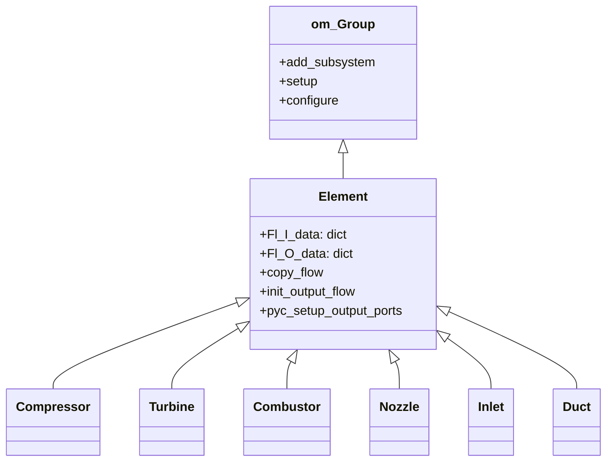
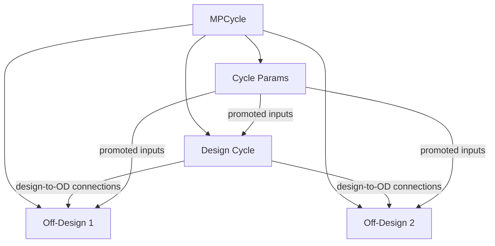

# Architecture Overview

## Module Structure

```
pycycle/                          # Main library
├── __init__.py                   # Version only
├── api.py                        # Public API re-exports
├── constants.py                  # Physical constants, compositions, unit factors
├── element_base.py               # Element base class
├── flow_in.py                    # FlowIn component - flow port inputs
├── connect_flow.py               # Legacy connect_flow function - deprecated
├── mp_cycle.py                   # Cycle and MPCycle group classes
├── passthrough.py                # PassThrough helper component
├── viewers.py                    # Output printing and plotting utilities
│
├── elements/                     # Thermodynamic cycle elements
│   ├── ambient.py                # US1976 atmosphere wrapper
│   ├── bleed_out.py              # Bleed extraction element
│   ├── cfd_start.py              # CFD boundary condition start
│   ├── combustor.py              # Combustion element
│   ├── compressor.py             # Compressor + corrected inputs + efficiency
│   ├── compressor_map.py         # Compressor map interpolation
│   ├── cooling.py                # Turbine cooling calculations
│   ├── duct.py                   # Duct with pressure loss
│   ├── flight_conditions.py      # Freestream conditions from alt/Mach
│   ├── flow_start.py             # Fixed flow property source
│   ├── gearbox.py                # Mechanical gearbox
│   ├── inlet.py                  # Inlet with ram recovery
│   ├── mixer.py                  # Stream mixer - impulse balance
│   ├── nozzle.py                 # CV/CD/CV_CD nozzle
│   ├── performance.py            # Cycle-level performance metrics
│   ├── shaft.py                  # Mechanical shaft power balance
│   ├── splitter.py               # Flow splitter
│   ├── turbine.py                # Turbine + corrected inputs + efficiency
│   ├── turbine_map.py            # Turbine map interpolation
│   └── US1976.py                 # US Standard Atmosphere 1976
│
├── thermo/                       # Thermodynamic property packages
│   ├── thermo.py                 # Thermo and ThermoAdd dispatcher
│   ├── static_ps_calc.py         # Explicit static property calculator
│   ├── static_ps_resid.py        # Implicit static property residual
│   ├── unit_comps.py             # Unit conversion passthrough components
│   ├── cea/                      # Chemical Equilibrium with Applications
│   │   ├── chem_eq.py            # Chemical equilibrium solver
│   │   ├── props_calcs.py        # Property calculations from equilibrium
│   │   ├── props_rhs.py          # RHS for property linear systems
│   │   ├── species_data.py       # Species database and JANAF data
│   │   ├── thermo_add.py         # Composition mixing for CEA
│   │   └── thermo_data/          # Thermochemical datasets
│   └── tabular/                  # Pre-computed table interpolation
│       ├── tabular_thermo.py     # MetaModelStructuredComp-based lookup
│       ├── thermo_add.py         # Composition mixing for tabular
│       └── air_jetA*.pkl         # Pickled lookup tables
│
└── maps/                         # Component performance maps
    ├── map_data.py               # MapData container class - 4 lines
    ├── axi3_2.py / axi5.py       # Compressor maps from NPSS
    ├── Fan_map.py / LPC_map.py    # Fan and LPC maps
    ├── HPC_map.py                 # HPC map
    ├── HPT_map.py / LPT_map.py   # Turbine maps
    ├── hpt1269.py / lpt2269.py    # Named turbine maps
    └── ncp01.py                   # Default compressor map
```

## Core Design Patterns

### 1. Element-Based Architecture

All cycle components inherit from [`Element`](../../pycycle/element_base.py:9) which extends `om.Group`:



**Key observation**: Not all elements inherit from `Element`. [`Shaft`](../../pycycle/elements/shaft.py:6) extends `ExplicitComponent` directly, and [`Performance`](../../pycycle/elements/performance.py) is an `ExplicitComponent`. This inconsistency means these components cannot participate in the flow graph propagation.

### 2. Flow Graph Propagation

[`Cycle.setup()`](../../pycycle/mp_cycle.py:74) uses a **networkx directed graph** to propagate thermodynamic configuration data between connected elements:

1. User calls [`pyc_connect_flow()`](../../pycycle/mp_cycle.py:156) which builds the graph and issues OpenMDAO connections
2. During setup, a BFS traversal processes the graph: each element's `pyc_setup_output_ports()` is called, and port data flows from source to target elements
3. This mechanism propagates composition data, thermo method, and species information without explicit user intervention

**Key observation**: The graph is built during `__init__`/`add_subsystem` but traversed during `setup()`. This two-phase pattern can lead to ordering issues if elements are added after flow connections.

### 3. Thermo Dispatcher Pattern

[`Thermo`](../../pycycle/thermo/thermo.py:15) acts as a **strategy dispatcher** — it selects between CEA and tabular backends based on the `method` option:

```
Thermo(method='CEA')     → cea.chem_eq.SetTotalTP
Thermo(method='TABULAR') → tabular.tabular_thermo.SetTotalTP
```

Each backend must implement the same interface: accept `T`, `P`, `composition` inputs and produce `h`, `S`, `gamma`, `Cp`, `Cv`, `rho`, `R` outputs. The `Thermo` group also adds:
- Balance components for non-TP modes — seeking `T` that matches `h` or `S`
- Static property calculation — via [`PsResid`](../../pycycle/thermo/static_ps_resid.py:8) or [`PsCalc`](../../pycycle/thermo/static_ps_calc.py)
- Unit conversion — via [`EngUnitProps`](../../pycycle/thermo/unit_comps.py:51) and [`EngUnitStaticProps`](../../pycycle/thermo/unit_comps.py)

### 4. Multi-Point Cycle Pattern

[`MPCycle`](../../pycycle/mp_cycle.py:197) manages design and off-design operating points:



Design-to-off-design connections transfer sizing data — areas, map scalars, corrected flows — from the design point to each off-design point. This uses [`configure()`](../../pycycle/mp_cycle.py:250) which runs after all children are set up.

### 5. Map Integration Pattern

Component maps use OpenMDAO's `MetaModelStructuredComp` for N-D interpolation. The pattern:

1. Map data stored in Python modules as numpy arrays on a [`MapData`](../../pycycle/maps/map_data.py:3) container
2. [`CompressorMap`](../../pycycle/elements/compressor_map.py) / [`TurbineMap`](../../pycycle/elements/turbine_map.py) wrap the interpolation
3. Design mode: map outputs are inputs — user specifies PR, eff; map computes scalars
4. Off-design mode: map outputs drive the element — scalars from design applied to map lookups

## Key Dependencies

| Dependency | Version | Role |
|-----------|---------|------|
| OpenMDAO | ≥3.10.0 | Framework: `om.Group`, `om.ExplicitComponent`, `om.ImplicitComponent`, solvers |
| NumPy | ≥1.20.0 | Array operations, map data storage |
| SciPy | ≥1.7.0 | Used in [`static_ps_resid.py`](../../pycycle/thermo/static_ps_resid.py:2) for `fsolve` |
| NetworkX | implied | Flow graph in [`mp_cycle.py`](../../pycycle/mp_cycle.py:6) |
| Matplotlib | optional | Plotting in [`viewers.py`](../../pycycle/viewers.py:8) |

**Notable**: NetworkX is imported but not listed as a dependency in [`pyproject.toml`](../../pyproject.toml:28). It comes transitively through OpenMDAO.

## File Size Distribution

| Category | Files | Total Size | Largest File |
|----------|-------|-----------|-------------|
| Elements | 18 | ~200 KB | [`turbine.py`](../../pycycle/elements/turbine.py) 27 KB |
| Thermo | 12 | ~90 KB | [`thermo.py`](../../pycycle/thermo/thermo.py) 11 KB |
| Maps | 11 | ~80 KB | [`ncp01.py`](../../pycycle/maps/ncp01.py) 10 KB |
| Core | 7 | ~35 KB | [`mp_cycle.py`](../../pycycle/mp_cycle.py) 12 KB |
| Tests | 22 | ~130 KB | [`test_cooling.py`](../../pycycle/elements/test/test_cooling.py) 16 KB |
| Examples | 10+ | ~150 KB | [`N3ref.py`](../../example_cycles/N+3ref/N3ref.py) 30 KB |

## Observations

### Strengths

1. **Clean element abstraction** — each engine component is a self-contained `om.Group` with standardised flow ports
2. **Dual thermo backends** — CEA for accuracy, tabular for speed — well-architected dispatcher
3. **Flow graph propagation** — automated composition and thermo data propagation reduces user boilerplate
4. **Analytic derivatives** — most components implement `compute_partials()` for gradient-based optimisation
5. **Multi-point framework** — `MPCycle` with auto design-to-OD connections is powerful

### Weaknesses

1. **Inconsistent element hierarchy** — `Shaft`, `Performance` don't extend `Element`
2. **No type hints** — zero type annotations in the entire codebase
3. **Limited error handling** — many components silently produce bad values instead of raising errors
4. **Hard-coded solver settings** — no way to configure solvers from cycle level
5. **Manual flow wiring** — users must write dozens of `connect()` calls for each cycle
6. **Pickle-based thermo data** — [`air_jetA.pkl`](../../pycycle/thermo/tabular/air_jetA.pkl) loaded at import time in [`constants.py`](../../pycycle/constants.py:32); security and versioning concerns
7. **Dual build system** — both [`setup.py`](../../setup.py) and [`pyproject.toml`](../../pyproject.toml) coexist
