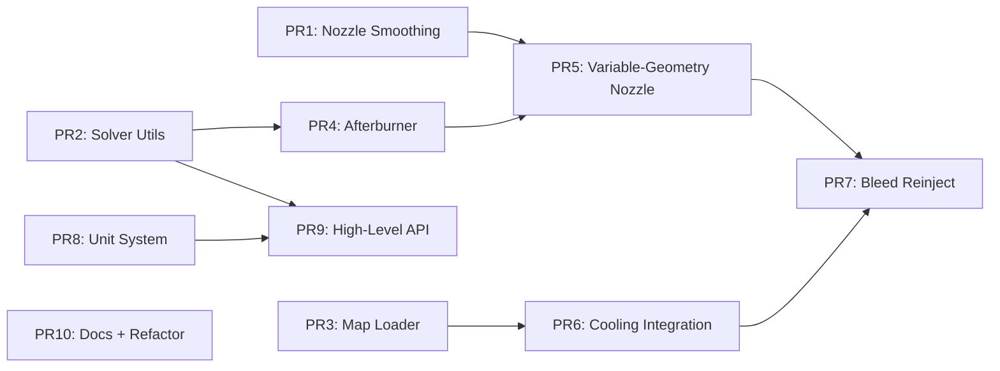

# PR Roadmap — Prioritised Pull Request Plan

## Overview

The following PRs are ordered by impact, dependency, and risk reduction. Earlier PRs establish infrastructure that later PRs build upon.

## PR 1 — Nozzle Smoothing Patch

**Type**: PATCH  
**Files modified**: [`pycycle/elements/nozzle.py`](../../pycycle/elements/nozzle.py)  
**Risk**: LOW — localised change, preserves physics

### Scope
- Replace discrete pressure/Mach switch with logistic blending function
- Add configurable `kappa` parameter for blending sharpness
- Add solver configuration options — `internal_solver_atol`, `internal_solver_maxiter`
- Add tests verifying smooth derivative across choke transition

### Acceptance Criteria
- Existing nozzle tests pass unchanged — within tolerance
- `check_partials()` passes at choke boundary
- No convergence failures in throttle sweep across choking

---

## PR 2 — Solver Configuration & Continuation Utilities

**Type**: MITIGATE + INTEGRATE  
**Files**: New `pycycle/solver_utils.py`, modified [`pycycle/element_base.py`](../../pycycle/element_base.py), [`pycycle/mp_cycle.py`](../../pycycle/mp_cycle.py)  
**Risk**: LOW — utilities are additive

### Scope
- Add `solver_type`, `solver_atol`, `solver_rtol`, `solver_maxiter` options to `Element` and `Cycle`
- Propagate solver settings from `Cycle` to child elements in `setup()`
- Implement `ContinuationManager` — ramp parameters with adaptive step size
- Implement `solve_case_sequence()` on `MPCycle` — warm-start sweep
- Add examples demonstrating usage

### Acceptance Criteria
- Solver options propagate correctly to all elements
- `ContinuationManager` converges cases that diverge without it
- `solve_case_sequence()` produces correct results with warm-starting

---

## PR 3 — Map Loader & Unified Scaler

**Type**: INTEGRATE  
**Files**: New `pycycle/map_utils.py`, modified [`pycycle/maps/map_data.py`](../../pycycle/maps/map_data.py), [`pycycle/elements/turbine_map.py`](../../pycycle/elements/turbine_map.py), [`pycycle/elements/compressor_map.py`](../../pycycle/elements/compressor_map.py)  
**Risk**: MEDIUM — changes map infrastructure

### Scope
- Replace `MapData` with proper `dataclass` — `CompressorMapData`, `TurbineMapData`
- Add `load_map()` function for CSV/NPSS format ingestion with validation
- Implement unified `MapScaler` class for both compressor and turbine
- Add `SurgeMarginCalc` component to compressor map
- Add map boundary warnings when extrapolating
- Document map conventions — axes, units, scaling

### Acceptance Criteria
- Existing maps load correctly via new dataclass constructors
- `load_map()` handles sample CSV files and validates shapes
- `SurgeMarginCalc` produces correct margin values
- All existing map tests pass unchanged

---

## PR 4 — Afterburner Element

**Type**: INTEGRATE  
**Files**: New `pycycle/elements/afterburner.py`, new tests  
**Depends on**: PR 2 — continuation manager for light-off testing  
**Risk**: MEDIUM — new element with complex physics

### Scope
- Create `Afterburner` element extending `Element`
- Implement `ThermoAdd` fuel mixing with reheat-specific pressure loss
- Add `AB_switch` input with logistic smooth light-off
- Add `FAR_max` safety limit
- Add `dPqP_AB` for reheat pressure loss — default 5-10%
- Design and off-design modes matching combustor pattern
- Unit tests + integration test with turbojet cycle

### Acceptance Criteria
- Afterburner produces expected temperature rise and thrust increase
- Light-off transition is smooth — continuous derivatives
- Energy conservation verified
- Pressure loss matches specified `dPqP_AB`

---

## PR 5 — Variable-Geometry Nozzle

**Type**: PATCH  
**Files**: Modified [`pycycle/elements/nozzle.py`](../../pycycle/elements/nozzle.py)  
**Depends on**: PR 1 — smoothing already applied; PR 4 — AB coupling  
**Risk**: LOW — extends existing nozzle

### Scope
- Add `nozzType='variable_CD'` option
- Accept `A_exit` as input — promoted to cycle level
- Compute exit static properties from area via `Thermo(mode='static_A')`
- Add area ratio `A_exit / A_throat` as output
- Add AB-nozzle coupling example using `ExecComp`

### Acceptance Criteria
- Variable nozzle produces correct exit Mach for specified area
- Area sweep matches analytic C-D nozzle equations
- Coupled AB-nozzle converges across light-off transition

---

## PR 6 — Cooling Integration in Turbine

**Type**: INTEGRATE  
**Files**: Modified [`pycycle/elements/turbine.py`](../../pycycle/elements/turbine.py), modified [`pycycle/elements/cooling.py`](../../pycycle/elements/cooling.py)  
**Depends on**: PR 3 — map improvements for multi-stage modelling  
**Risk**: HIGH — modifies core turbine element

### Scope
- Add `cooling_rows` option to `Turbine`
- For each row: integrate `CoolingCalcs`, mix cooling flow, adjust work
- Expose `W_cool`, `Pt_stage`, `Tt_stage` as outputs
- Add helper `add_cooling_reinject()` inside turbine
- Complete assertions in [`test_cooling.py`](../../pycycle/elements/test/test_cooling.py)

### Acceptance Criteria
- Cooling mass flow matches analytic correlations
- Turbine power correctly reduced by cooling penalty
- Mixed flow properties at each stage are thermodynamically consistent
- All existing turbine tests pass

---

## PR 7 — Bleed Reinjection Element

**Type**: INTEGRATE  
**Files**: New `pycycle/elements/bleed_reinject.py`, new tests  
**Depends on**: PR 5, PR 6  
**Risk**: MEDIUM — new element

### Scope
- Create `BleedReinject` element with main + multiple bleed flow ports
- Use `ThermoAdd(mix_mode='flow')` for mass/enthalpy-conserving mixing
- Support design — Mach number — and off-design — area — static calculations
- Add mass conservation validation utility in `Cycle`

### Acceptance Criteria
- `BleedOut` → `BleedReinject` round-trip conserves mass and enthalpy
- Mixed properties match weighted-average calculations
- Solver converges at reinjection point in full cycle

---

## PR 8 — Unit System Support

**Type**: INTEGRATE + PATCH  
**Files**: Modified [`pycycle/mp_cycle.py`](../../pycycle/mp_cycle.py), [`pycycle/element_base.py`](../../pycycle/element_base.py), [`pycycle/thermo/unit_comps.py`](../../pycycle/thermo/unit_comps.py), new `pycycle/unit_utils.py`  
**Risk**: MEDIUM — touches many files

### Scope
- Add `unit_system` option to `Cycle` and `Element` — `ENG` or `SI`
- Create `UnitProps` replacing `EngUnitProps` — respects `unit_system` setting
- Create `pycycle/unit_utils.py` with unit system mappings
- Deprecate explicit `g_c` usage — use OpenMDAO units
- Update documentation with unit tables

### Acceptance Criteria
- `unit_system='ENG'` produces identical results to current code
- `unit_system='SI'` produces correct results in SI units
- Full cycle converges in both unit systems
- `check_partials()` passes in both systems

---

## PR 9 — High-Level API & Configuration

**Type**: INTEGRATE  
**Files**: Modified [`pycycle/api.py`](../../pycycle/api.py), new `pycycle/engine_config.py`  
**Depends on**: PR 2 — solver utils; PR 8 — unit system  
**Risk**: LOW — additive, no existing code changes

### Scope
- Add `simulate(engine_config, operating_point)` function
- Add `sweep(engine_config, sweep_params)` function with warm-start
- Define `EngineConfig` dataclass with validation
- Provide template builders — `build_turbojet()`, `build_turbofan()`
- Add usage examples and documentation

### Acceptance Criteria
- `simulate()` produces correct results matching manually assembled cycles
- `sweep()` produces correct results with warm-starting
- Invalid configs produce clear error messages
- Template builders produce converging cycles

---

## PR 10 — Documentation & Refactoring

**Type**: PATCH + MITIGATE  
**Files**: All Python files — docstrings, type hints; documentation files  
**Risk**: LOW — no behaviour changes

### Scope
- Add type hints to all public functions and methods
- Add Google-style docstrings to all classes and public methods
- Standardise string formatting to f-strings
- Standardise `super()` calls to new style
- Remove deprecated code — `DeprecatedDict`, `connect_flow`, `pyc_add_element`
- Remove `setup.py` and `.travis.yml`
- Remove commented-out code
- Fix undefined `AnalysisError` reference in [`turbine.py`](../../pycycle/elements/turbine.py:43)
- Add core module tests — `element_base`, `mp_cycle`, `api`, `viewers`
- Add CI steps for `mypy`, `black`, coverage upload

### Acceptance Criteria
- `mypy --strict` passes — or at least `mypy` with `--ignore-missing-imports`
- `black --check` passes
- All existing tests pass
- No deprecated code remains
- Test coverage increases by ≥20%

---

## Summary Table

| PR | Name | Type | Risk | Depends On |
|----|------|------|------|-----------|
| 1 | Nozzle Smoothing | PATCH | LOW | — |
| 2 | Solver Utils | MITIGATE+INTEGRATE | LOW | — |
| 3 | Map Loader & Scaler | INTEGRATE | MEDIUM | — |
| 4 | Afterburner | INTEGRATE | MEDIUM | PR 2 |
| 5 | Variable-Geometry Nozzle | PATCH | LOW | PR 1, PR 4 |
| 6 | Cooling Integration | INTEGRATE | HIGH | PR 3 |
| 7 | Bleed Reinjection | INTEGRATE | MEDIUM | PR 5, PR 6 |
| 8 | Unit System | INTEGRATE+PATCH | MEDIUM | — |
| 9 | High-Level API | INTEGRATE | LOW | PR 2, PR 8 |
| 10 | Docs & Refactoring | PATCH+MITIGATE | LOW | — |

**Recommended landing order**: PR 10 → PR 1 → PR 2 → PR 3 → PR 8 → PR 4 → PR 5 → PR 6 → PR 7 → PR 9

> Note: PR 10 — cleanup — can be done in parallel with early PRs. PR 1-3 and PR 8 are independent and can be developed concurrently.
