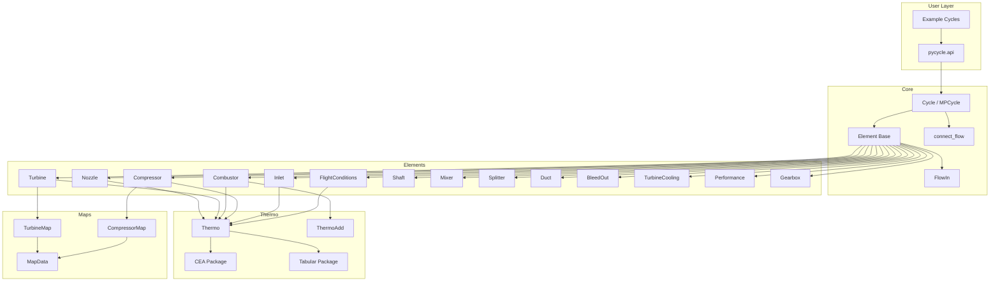

# pyCycle Codebase Audit

> **Date**: February 2026  
> **Version audited**: 4.4.1.dev0  
> **OpenMDAO**: ≥3.10.0  
> **Python**: ≥3.10

## Purpose

This audit provides a comprehensive analysis of the pyCycle repository — a thermodynamic cycle modelling library for gas turbine engines built on OpenMDAO. It identifies risks, code quality issues, architectural patterns, and areas for improvement.

## Audit Documents

| # | Document | Description |
|---|----------|-------------|
| 1 | [Architecture Overview](01_architecture_overview.md) | Deep-dive into codebase structure, module relationships, and design patterns |
| 2 | [Risk: Convergence & Solver Stability](02_risk_convergence_solver.md) | Newton solver robustness, continuation strategies, initial guesses |
| 3 | [Risk: Map Conventions & Scaling](03_risk_map_conventions.md) | Compressor/turbine map handling, scaling factors, surge margin |
| 4 | [Risk: Afterburner & Variable Geometry](04_risk_afterburner_variable_geometry.md) | Missing afterburner element, variable-geometry nozzle |
| 5 | [Risk: Cooling & Bleed Integration](05_risk_cooling_bleed.md) | Turbine cooling, bleed reinjection, thermal management |
| 6 | [Risk: Unit Consistency](06_risk_unit_consistency.md) | Mixed imperial/SI units, conversion issues |
| 7 | [Risk: Maintainability & UX](07_risk_maintainability.md) | API complexity, documentation gaps, code structure |
| 8 | [Code Quality Findings](08_code_quality_findings.md) | TODOs, deprecated code, test gaps, code smells |
| 9 | [PR Roadmap](09_pr_roadmap.md) | Prioritised pull request plan for landing improvements |

## Summary of Key Findings

### Critical Risks

1. **Solver Stability** — No global continuation/homotopy strategy; discrete switches in nozzle choking cause Newton failures
2. **Missing Physics** — No afterburner element; variable-geometry nozzle not supported; cooling not integrated into turbine
3. **Map System** — No standardised map ingestion; no surge margin computation; manual scaling is error-prone

### High-Impact Issues

4. **Unit Inconsistency** — Mixed imperial/SI defaults across elements; no `unit_system` option
5. **Test Coverage Gaps** — [`pycycle/tests/test_element.py`](../pycycle/tests/test_element.py) is empty; no integration tests for full cycles
6. **Deprecated Code Still Present** — [`DeprecatedDict`](../pycycle/constants.py:6) and legacy functions remain active
7. **Zero Type Hints** — No type annotations anywhere in the codebase

### Moderate Issues

8. **Documentation** — Self-described as "nearly non-existent" in [`README.md`](../README.md:11)
9. **Build System Duplication** — Both [`setup.py`](../setup.py) and [`pyproject.toml`](../pyproject.toml) define package metadata
10. **Stale CI** — [`.travis.yml`](./.travis.yml) references Python 3.6 and is superseded by GitHub Actions

## Architecture Diagram

## Methodology

The audit was conducted by:

1. **Static analysis** of all Python source files in `pycycle/`, `example_cycles/`, and configuration files
2. **Pattern search** for TODOs, FIXMEs, deprecated code, and code smells
3. **Dependency analysis** of module imports and OpenMDAO integration points
4. **Architecture review** of the `Cycle` → `Element` → `Thermo` hierarchy
5. **Test coverage assessment** of unit and integration tests
6. **CI/CD review** of GitHub Actions workflows and legacy Travis CI

---

*See the [Improvement Plan](../improvement_plan/README.md) for detailed, categorised improvement proposals.*
