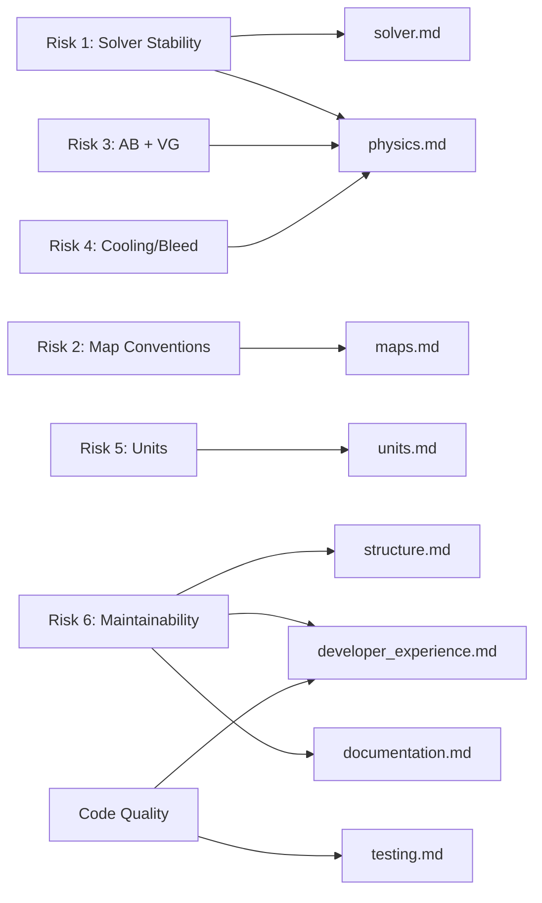

# pyCycle Improvement Plan

> **Based on**: [Codebase Audit](../audit/README.md)  
> **Date**: February 2026  
> **Version**: 4.4.1.dev0

## Purpose

This directory contains detailed, categorised improvement proposals for the pyCycle library. Each document focuses on a specific domain and provides actionable items that can be implemented independently.

## Improvement Categories

| # | Category | Document | Scope |
|---|----------|----------|-------|
| 1 | **Structure** | [structure.md](structure.md) | Architecture, module organisation, API design, build system |
| 2 | **Solver** | [solver.md](solver.md) | Convergence, continuation, warm-start, solver configuration |
| 3 | **Physics** | [physics.md](physics.md) | Afterburner, variable geometry, cooling, bleed, nozzle smoothing |
| 4 | **Maps** | [maps.md](maps.md) | Map loading, scaling, surge margin, validation |
| 5 | **Units** | [units.md](units.md) | Unit system option, SI support, g_c deprecation |
| 6 | **Testing** | [testing.md](testing.md) | Test coverage, CI improvements, benchmarks |
| 7 | **Documentation** | [documentation.md](documentation.md) | API docs, tutorials, docstrings, Sphinx rebuild |
| 8 | **Developer Experience** | [developer_experience.md](developer_experience.md) | Type hints, linting, formatting, error handling |

## Cross-Reference to Audit Risks

## Implementation Priority

### Phase 1 — Foundation
Cleanup, testing infrastructure, and solver robustness
- `developer_experience.md` — type hints, deprecated code removal, linting
- `testing.md` — fill test gaps, add CI checks
- `solver.md` — continuation manager, warm-start

### Phase 2 — Infrastructure
Map system, unit support, nozzle improvements
- `maps.md` — loader, scaler, surge margin
- `units.md` — unit system option
- `physics.md` — nozzle smoothing, variable geometry

### Phase 3 — New Physics
Afterburner, cooling integration, bleed reinjection
- `physics.md` — afterburner element, cooling-integrated turbine, bleed reinject

### Phase 4 — User Experience
High-level API, configuration schema, documentation
- `structure.md` — high-level API, templates, configuration
- `documentation.md` — tutorials, Sphinx rebuild, API reference

## How to Use This Plan

1. **Pick a category** that aligns with your current focus
2. **Read the detailed document** — each lists specific actionable items
3. **Check dependencies** — some items depend on others being completed first
4. **Reference the PR Roadmap** — see [audit/09_pr_roadmap.md](../audit/09_pr_roadmap.md) for implementation ordering
5. **Track progress** — mark items as done as they are implemented

---

*Each improvement document references specific files, line numbers, and code patterns from the [audit](../audit/README.md).*
