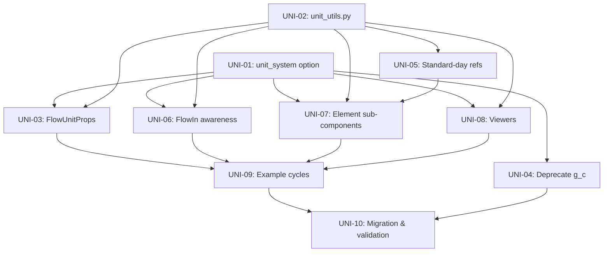

# Improvement Plan: Unit System

**Related audit**: [Risk 5: Unit Consistency](../audit/06_risk_unit_consistency.md)
**Related PRs**: PR 8 — Unit System Support

---

## Overall Approach: Unified SI / Imperial Configuration

### Problem Statement

pyCycle has three distinct unit layers that independently choose their unit systems:

| Layer | Current Units | Location |
|-------|--------------|----------|
| User-facing flow stations | Imperial (degR, psi, lbm/s) | [`FlowIn`](../../pycycle/flow_in.py:10), [`EngUnitProps`](../../pycycle/thermo/unit_comps.py:51) |
| Internal thermo calculations | SI (degK, Pa, J/kg) | [`PsResid`](../../pycycle/thermo/static_ps_resid.py:8), [`tabular_thermo.py`](../../pycycle/thermo/tabular/tabular_thermo.py:33) |
| Element compute functions | Mixed — hard-coded imperial constants | [`compressor.py`](../../pycycle/elements/compressor.py:37), [`nozzle.py`](../../pycycle/elements/nozzle.py:112), [`inlet.py`](../../pycycle/elements/inlet.py:80) |

There is no single switch to say "everything in SI" or "everything in Imperial". Hard-coded constants like [`g_c`](../../pycycle/constants.py:61), [`BTU_s2HP`](../../pycycle/constants.py:55), [`P_STDeng`](../../pycycle/constants.py:66), and [`T_STDeng`](../../pycycle/constants.py:65) bake imperial assumptions into compute functions.

### Design Principle

**Internal calculations stay in a canonical system; user-facing I/O respects the chosen system.**

The internal thermo layer already works in SI (degK, Pa, J/kg). OpenMDAO's unit framework automatically converts at connection boundaries. The strategy is:

1. **Do not change internal thermo** — [`PsResid`](../../pycycle/thermo/static_ps_resid.py:8) and CEA/tabular solvers remain in SI internally.
2. **All user-facing I/O** (inputs, outputs, flow stations, viewers) declares units using a central mapping driven by a single `unit_system` setting.
3. **Eliminate hard-coded unit constants** from compute functions — let OpenMDAO's unit framework handle conversions, or use system-aware constants from [`unit_utils.py`](../../pycycle/unit_utils.py).
4. **One configuration point** — set `unit_system='SI'` or `unit_system='ENG'` on the [`Cycle`](../../pycycle/mp_cycle.py:18), and it propagates to every element and sub-component.

### Architecture Diagram

```
┌────────────────────────────────────────────────────────────┐
│  Cycle(unit_system='SI' | 'ENG')                           │
│                                                            │
│  ┌─── propagate to all children ───────────────────────┐   │
│  │                                                     │   │
│  │  Element.options['unit_system']                     │   │
│  │     │                                               │   │
│  │     ├── FlowIn  ──── uses get_unit('temperature',   │   │
│  │     │                              system) → degK   │   │
│  │     │                                    or degR    │   │
│  │     │                                               │   │
│  │     ├── Compute sub-components                      │   │
│  │     │     uses system-aware constants from           │   │
│  │     │     unit_utils.py (STD_DAY, CONV_FACTORS)     │   │
│  │     │                                               │   │
│  │     ├── Internal Thermo (always SI internally)      │   │
│  │     │     PsResid, CEA, Tabular — unchanged         │   │
│  │     │     OpenMDAO converts at connections           │   │
│  │     │                                               │   │
│  │     └── FlowUnitProps  ──── outputs in chosen       │   │
│  │                              system (replaces       │   │
│  │                              EngUnitProps)           │   │
│  └─────────────────────────────────────────────────────┘   │
│                                                            │
│  Viewers / print_flow  ──── reads unit_system from Cycle   │
│                              formats output accordingly    │
└────────────────────────────────────────────────────────────┘
```

### Key Invariant

**Numerical results must be identical** regardless of `unit_system` setting. The only difference is the unit labels and scale factors on inputs/outputs. Since OpenMDAO handles all conversions, a model built with `unit_system='SI'` and one with `unit_system='ENG'` must produce the same physical results (within floating-point tolerance).

### Implementation Phases

| Phase | Items | Focus |
|-------|-------|-------|
| **Phase 2a** | UNI-01, UNI-02, UNI-05 | Foundation — option plumbing, unit registry, standard-day refs |
| **Phase 2b** | UNI-03, UNI-06, UNI-07 | Adoption — FlowIn, FlowUnitProps, element sub-components |
| **Phase 2c** | UNI-08, UNI-09 | Polish — viewers, example cycles, full SI demo |
| **Phase 3**  | UNI-04, UNI-10 | Cleanup — deprecate `g_c`, remove legacy constants, migration tests |

---

## UNI-01: `unit_system` Option on Cycle and Element

**Current state**: No way to specify preferred unit system. Elements independently choose imperial or SI defaults.

**Improvement**: Add `unit_system` option to [`Cycle`](../../pycycle/mp_cycle.py:13) and [`Element`](../../pycycle/element_base.py:9):

```python
# In Cycle.initialize()
self.options.declare('unit_system', default='ENG', values=['ENG', 'SI'],
    desc='Unit system for default values and flow station outputs')

# In Element.initialize()
self.options.declare('unit_system', default='ENG', values=['ENG', 'SI'],
    desc='Unit system — inherited from parent Cycle')
```

Propagate in `Cycle.setup()` alongside other cycle-level options:

```python
cycle_level_options = ['thermo_method', 'thermo_data', 'design', 'unit_system']
```

**Files to modify**:
- [`pycycle/element_base.py`](../../pycycle/element_base.py:21) — add option
- [`pycycle/mp_cycle.py`](../../pycycle/mp_cycle.py:16) — add option and propagation

**Depends on**: Nothing  
**Risk**: LOW — adding option is non-breaking; behaviour change only when set to 'SI'

---

## UNI-02: Unit System Mappings

**Current state**: No centralised mapping between variable types and unit strings.

**Improvement**: New module `pycycle/unit_utils.py`:

```python
UNIT_SYSTEMS = {
    'ENG': {
        'temperature': 'degR',
        'pressure': 'lbf/inch**2',
        'mass_flow': 'lbm/s',
        'enthalpy': 'Btu/lbm',
        'entropy': 'Btu/(lbm*degR)',
        'velocity': 'ft/s',
        'area': 'inch**2',
        'density': 'lbm/ft**3',
        'power': 'hp',
        'torque': 'ft*lbf',
        'force': 'lbf',
        'length': 'ft',
        'gas_constant': 'Btu/(lbm*degR)',
        'specific_heat': 'Btu/(lbm*degR)',
    },
    'SI': {
        'temperature': 'degK',
        'pressure': 'Pa',
        'mass_flow': 'kg/s',
        'enthalpy': 'J/kg',
        'entropy': 'J/(kg*degK)',
        'velocity': 'm/s',
        'area': 'm**2',
        'density': 'kg/m**3',
        'power': 'W',
        'torque': 'N*m',
        'force': 'N',
        'length': 'm',
        'gas_constant': 'J/(kg*degK)',
        'specific_heat': 'J/(kg*degK)',
    }
}

def get_unit(var_type: str, system: str = 'ENG') -> str:
    """Get the unit string for a variable type in the given system."""
    return UNIT_SYSTEMS[system][var_type]

def get_default_value(var_type: str, system: str = 'ENG') -> float:
    """Get a sensible default value for a variable type."""
    defaults_eng = {
        'temperature': 518.67,    # degR - standard day
        'pressure': 14.696,       # psi - sea level
        'mass_flow': 100.0,       # lbm/s
        'enthalpy': -20.0,        # Btu/lbm
        'entropy': 1.66,          # Btu/(lbm*degR)
        'velocity': 500.0,        # ft/s
        'area': 500.0,            # inch**2
    }
    defaults_si = {
        'temperature': 288.15,    # degK - standard day
        'pressure': 101325.0,     # Pa - sea level
        'mass_flow': 45.0,        # kg/s
        'enthalpy': -46500.0,     # J/kg
        'entropy': 6950.0,        # J/(kg*degK)
        'velocity': 150.0,        # m/s
        'area': 0.32,             # m**2
    }
    return (defaults_eng if system == 'ENG' else defaults_si).get(var_type)
```

**Files to create**: `pycycle/unit_utils.py`  
**Depends on**: UNI-01  
**Risk**: LOW — new utility module

---

## UNI-03: Generic UnitProps Component

**Current state**: [`EngUnitProps`](../../pycycle/thermo/unit_comps.py:51) hard-codes imperial units for flow station outputs. Its name encodes "Eng" = English.

**Improvement**: Replace with `FlowUnitProps` that respects `unit_system`:

```python
class FlowUnitProps(UnitCompBase):
    """Convert internal thermo properties to user's preferred unit system."""
    
    def initialize(self):
        super().initialize()
        self.options.declare('unit_system', default='ENG', values=['ENG', 'SI'])
    
    def setup_io(self, composition):
        system = self.options['unit_system']
        
        self.add_input('T', val=284., units=get_unit('temperature', system))
        self.add_input('P', val=1., units=get_unit('pressure', system))
        self.add_input('h', val=1., units=get_unit('enthalpy', system))
        self.add_input('S', val=1., units=get_unit('entropy', system))
        self.add_input('gamma', val=1.4)
        self.add_input('Cp', val=1., units=get_unit('specific_heat', system))
        self.add_input('Cv', val=1., units=get_unit('specific_heat', system))
        self.add_input('rho', val=1., units=get_unit('density', system))
        self.add_input('R', val=1., units=get_unit('gas_constant', system))
        # ...composition...
        
        super().setup_io()
```

Keep `EngUnitProps` as a deprecated alias.

**Files to modify**: [`pycycle/thermo/unit_comps.py`](../../pycycle/thermo/unit_comps.py)  
**Depends on**: UNI-01, UNI-02  
**Risk**: MEDIUM — changes flow station output units when SI is selected

---

## UNI-04: Deprecate `g_c` Usage

**Current state**: [`g_c = 32.174`](../../pycycle/constants.py:61) is used in nozzle thrust and other force calculations. In SI, `g_c = 1` by definition.

**Improvement**: Replace explicit `g_c` usage with proper OpenMDAO unit handling:

### Example — Nozzle Thrust

```python
# Current
self.add_output('Fg', units='lbf')
Fg = W * V / g_c + (Ps - P_ambient) * A / g_c

# Improved — let OpenMDAO handle the conversion
self.add_output('Fg', units='lbf')  # or 'N' for SI
# W is in lbm/s, V in ft/s → W*V is in lbm*ft/s²
# OpenMDAO knows that 1 lbf = 32.174 lbm*ft/s²
Fg = W * V  # natural units, let unit framework convert
```

**Phase 1**: Keep `g_c` but add deprecation warning when accessed  
**Phase 2**: Remove `g_c` usage from all elements

**Files to modify**:
- [`pycycle/constants.py`](../../pycycle/constants.py:61) — deprecation
- [`pycycle/elements/nozzle.py`](../../pycycle/elements/nozzle.py) — thrust calculation
- [`pycycle/elements/performance.py`](../../pycycle/elements/performance.py) — if applicable
- Any other files using `g_c`

**Depends on**: UNI-01  
**Risk**: MEDIUM — correctness-critical; requires careful validation

---

## UNI-05: Standard-Day Reference Values

**Current state**: Corrected flow uses imperial standard-day values:
```python
T_STDeng = 518.67   # degR
P_STDeng = 14.695951 # psi
```

These are used in [`compressor.py`](../../pycycle/elements/compressor.py:39) for theta/delta calculations.

**Improvement**: Add SI equivalents and select based on `unit_system`:

```python
STD_DAY = {
    'ENG': {'T': 518.67, 'T_units': 'degR', 'P': 14.695951, 'P_units': 'lbf/inch**2'},
    'SI':  {'T': 288.15, 'T_units': 'degK', 'P': 101325.0, 'P_units': 'Pa'}
}
```

Since corrected flow corrections are based on ratios — theta = T/T_std, delta = P/P_std — the results are dimensionless and unit-system-independent. But having the proper reference values improves clarity.

**Files to modify**: [`pycycle/constants.py`](../../pycycle/constants.py)  
**Depends on**: UNI-02  
**Risk**: LOW

---

## UNI-06: FlowIn Unit Awareness

**Current state**: [`FlowIn`](../../pycycle/flow_in.py) hard-codes imperial units for all inputs — degR, psi, lbm/s.

**Improvement**: Accept `unit_system` option and set units accordingly:

```python
class FlowIn(om.ExplicitComponent):
    def initialize(self):
        self.options.declare('fl_name', default='flow')
        self.options.declare('unit_system', default='ENG', values=['ENG', 'SI'])
    
    def setup(self):
        system = self.options['unit_system']
        T_unit = get_unit('temperature', system)
        P_unit = get_unit('pressure', system)
        # etc.
        
        self.add_input(f'{fl_name}:tot:T', val=518., units=T_unit, ...)
```

**Files to modify**: [`pycycle/flow_in.py`](../../pycycle/flow_in.py)  
**Depends on**: UNI-01, UNI-02  
**Risk**: MEDIUM

---

## UNI-07: Element Sub-Component Unit Awareness

**Current state**: Compute sub-components in elements like [`CorrectedInputsCalc`](../../pycycle/elements/compressor.py:16), [`Shaft`](../../pycycle/elements/shaft.py:6), nozzle [`Perf`](../../pycycle/elements/nozzle.py:86), and [`InletCalcs`](../../pycycle/elements/inlet.py:67) hard-code imperial unit strings and conversion constants.

Key examples:
- [`CorrectedInputsCalc`](../../pycycle/elements/compressor.py:21) — `units='degR'`, `units='psi'`, divides by `P_STDeng` / `T_STDeng`
- [`CompressorPower`](../../pycycle/elements/compressor.py:96) — uses `BTU_s2HP` and `HP_per_RPM_to_FT_LBF` in compute
- [`TurbinePower`](../../pycycle/elements/turbine.py:280) — same conversion constants
- [`Shaft`](../../pycycle/elements/shaft.py:31) — hard-codes `HP_to_FT_LBF_per_SEC = 550`
- Nozzle [`Perf`](../../pycycle/elements/nozzle.py:112) — uses `g_c` for thrust calculation
- [`InletCalcs`](../../pycycle/elements/inlet.py:80) — uses `g_c` for ram drag

**Improvement**: Each sub-component receives `unit_system` via its parent element and uses `get_unit()` for I/O declarations. For compute-internal conversions, replace hard-coded constants with system-aware values from `unit_utils.py`.

### Strategy — Let OpenMDAO Do The Work

The cleanest approach is to declare inputs/outputs in the user's chosen units and let OpenMDAO convert at boundaries. The internal thermo layer stays SI; OpenMDAO converts automatically when connecting SI outputs to imperial (or vice versa) inputs.

For conversion constants used *within* a single compute function (like `BTU_s2HP`), create a system-aware constant registry:

```python
# In unit_utils.py

CONV_FACTORS = {
    'ENG': {
        'enthalpy_to_power': 1.4148532,      # BTU_s2HP: (Btu/s) → hp
        'power_to_torque': 5252.11,           # HP_per_RPM_to_FT_LBF
        'gc': 32.174,                          # lbm·ft/(lbf·s²)
        'hp_to_ftlbf_per_s': 550.0,
    },
    'SI': {
        'enthalpy_to_power': 1e-3,            # (J/s) → kW  (or 1.0 for W)
        'power_to_torque': 9.5488,            # kW / (rad/s) → N·m  (via 60/(2π))
        'gc': 1.0,                             # dimensionless in SI
        'hp_to_ftlbf_per_s': 1.0,             # not used — torque = P/ω directly
    }
}

def get_conv(name: str, system: str = 'ENG') -> float:
    """Get a conversion factor for the given unit system."""
    return CONV_FACTORS[system][name]
```

### Example — CorrectedInputsCalc (refactored)

```python
from pycycle.unit_utils import get_unit, get_std_day

class CorrectedInputsCalc(om.ExplicitComponent):
    def initialize(self):
        self.options.declare('unit_system', default='ENG', values=['ENG', 'SI'])

    def setup(self):
        sys = self.options['unit_system']
        std = get_std_day(sys)

        self.T_std = std['T']
        self.P_std = std['P']

        self.add_input('Tt', val=std['T'], units=get_unit('temperature', sys))
        self.add_input('Pt', val=std['P'], units=get_unit('pressure', sys))
        self.add_input('W_in', val=30.0, units=get_unit('mass_flow', sys))
        self.add_input('Nmech', val=1000.0, units='rpm')

        self.add_output('Wc', val=30.0, units=get_unit('mass_flow', sys))
        self.add_output('Nc', val=100., lower=1e-5, units='rpm')
        # ...

    def compute(self, inputs, outputs):
        delta = inputs['Pt'] / self.P_std
        theta = inputs['Tt'] / self.T_std
        outputs['Wc'] = inputs['W_in'] * theta**0.5 / delta
        outputs['Nc'] = inputs['Nmech'] * theta**-0.5
```

### Example — Nozzle Thrust (refactored)

```python
from pycycle.unit_utils import get_unit, get_conv

class Perf(om.ExplicitComponent):
    def initialize(self):
        self.options.declare('unit_system', default='ENG', values=['ENG', 'SI'])
        self.options.declare('lossCoef', default='Cv')

    def setup(self):
        sys = self.options['unit_system']
        self._gc = get_conv('gc', sys)

        self.add_input('W_in', units=get_unit('mass_flow', sys))
        self.add_input('V_ideal', units=get_unit('velocity', sys))
        self.add_input('V_actual', units=get_unit('velocity', sys))
        self.add_output('Fg', units=get_unit('force', sys))
        self.add_output('Fg_ideal', units=get_unit('force', sys))
        # ...

    def compute(self, inputs, outputs):
        gc = self._gc  # 32.174 for ENG, 1.0 for SI
        outputs['Fg_ideal'] = (inputs['W_in'] / gc) * inputs['V_ideal']
        # ...
```

**Files to modify**:
- [`pycycle/elements/compressor.py`](../../pycycle/elements/compressor.py) — `CorrectedInputsCalc`, `CompressorPower`, `BleedPower`
- [`pycycle/elements/turbine.py`](../../pycycle/elements/turbine.py) — `TurbinePower`
- [`pycycle/elements/shaft.py`](../../pycycle/elements/shaft.py) — `Shaft`
- [`pycycle/elements/nozzle.py`](../../pycycle/elements/nozzle.py) — `PressureCalcs`, `Perf`
- [`pycycle/elements/inlet.py`](../../pycycle/elements/inlet.py) — `InletCalcs`
- [`pycycle/elements/performance.py`](../../pycycle/elements/performance.py) — `Performance`
- [`pycycle/elements/combustor.py`](../../pycycle/elements/combustor.py) — fuel flow units
- [`pycycle/elements/duct.py`](../../pycycle/elements/duct.py) — pressure units
- [`pycycle/elements/splitter.py`](../../pycycle/elements/splitter.py) — flow units
- [`pycycle/elements/mixer.py`](../../pycycle/elements/mixer.py) — flow units
- [`pycycle/elements/bleed_out.py`](../../pycycle/elements/bleed_out.py) — flow units
- [`pycycle/elements/flow_start.py`](../../pycycle/elements/flow_start.py) — flow units
- [`pycycle/elements/flight_conditions.py`](../../pycycle/elements/flight_conditions.py) — ambient units

**Depends on**: UNI-01, UNI-02, UNI-05
**Risk**: MEDIUM — each element must be individually validated; high-touch change

---

## UNI-08: Viewer & Print Output Unit Awareness

**Current state**: [`viewers.py`](../../pycycle/viewers.py) prints flow station data using hard-coded imperial labels and formatting. The `get_val()` helper can accept explicit `units` but all callers use imperial defaults.

**Improvement**: Make viewers respect the cycle's `unit_system` setting:

```python
# In viewers.py

from pycycle.unit_utils import UNIT_SYSTEMS

def print_flow_station(prob, point, element, unit_system='ENG'):
    """Print flow station data in the chosen unit system."""
    units = UNIT_SYSTEMS[unit_system]

    T = get_val(prob, point, element, 'Fl_O:tot:T', units=units['temperature'])
    P = get_val(prob, point, element, 'Fl_O:tot:P', units=units['pressure'])
    W = get_val(prob, point, element, 'Fl_O:stat:W', units=units['mass_flow'])
    # ...

    # Format with unit labels
    T_label = units['temperature']  # 'degK' or 'degR'
    print(f"  T = {T:10.4f} {T_label}")
    # ...
```

Add a `unit_system` parameter to all public viewer functions:
- `print_flow_station()`
- `print_compressor()`
- `print_turbine()`
- `print_nozzle()`
- `print_shaft()`
- `print_burner()`
- etc.

The viewer should also read `unit_system` from the cycle model if not explicitly specified:

```python
def _get_unit_system(prob, point, explicit=None):
    """Determine unit system from explicit arg or cycle options."""
    if explicit is not None:
        return explicit
    # Try to read from the cycle model
    try:
        return prob.model._get_subsystem(point).options['unit_system']
    except (AttributeError, KeyError):
        return 'ENG'  # fallback to imperial
```

**Files to modify**: [`pycycle/viewers.py`](../../pycycle/viewers.py)
**Depends on**: UNI-01, UNI-02
**Risk**: LOW — output-only change, no impact on numerics

---

## UNI-09: Example Cycles with `unit_system` Demonstration

**Current state**: All example cycles in [`example_cycles/`](../../example_cycles/) are written with imperial inputs, imperial balance targets, and imperial print outputs.

**Improvement**: For each example cycle, provide an SI variant or a parameterised version that accepts `unit_system`:

### Option A — Parameterised examples (preferred)

```python
# example_cycles/simple_turbojet.py

def build_turbojet(unit_system='ENG'):
    """Build a simple turbojet cycle in the specified unit system."""
    from pycycle.unit_utils import get_unit, get_default_value

    prob = om.Problem()
    cycle = prob.model = Cycle(unit_system=unit_system)

    # Use system-appropriate defaults
    T_unit = get_unit('temperature', unit_system)
    P_unit = get_unit('pressure', unit_system)
    # ...
```

### Option B — Separate SI example

Create `example_cycles/simple_turbojet_si.py` that mirrors the imperial version but uses SI units throughout. This serves as a reference and integration test.

### Validation

Each SI example must be verified against its imperial counterpart:

```python
def test_turbojet_si_vs_eng():
    """Verify SI and ENG turbojet produce identical physical results."""
    prob_eng = build_turbojet(unit_system='ENG')
    prob_si = build_turbojet(unit_system='SI')

    prob_eng.run_model()
    prob_si.run_model()

    # Compare in common units (e.g., Newtons for thrust)
    Fn_eng = prob_eng.get_val('perf.Fn', units='N')
    Fn_si = prob_si.get_val('perf.Fn', units='N')
    assert_near_equal(Fn_eng, Fn_si, tolerance=1e-8)
```

**Files to modify**: All files in [`example_cycles/`](../../example_cycles/)
**Files to create**: SI variants or parameterised wrappers
**Depends on**: UNI-01 through UNI-08
**Risk**: LOW — additive change

---

## UNI-10: Migration, Backwards Compatibility & Validation

**Current state**: No infrastructure to verify that the unit system refactoring produces identical results.

**Improvement**: Build a comprehensive validation and migration framework:

### 1. Golden-Value Regression Tests

Before any unit changes, capture reference outputs for all example cycles:

```python
# pycycle/elements/test/test_unit_system_regression.py

GOLDEN_VALUES = {
    'simple_turbojet': {
        'Fn': {'val': 11000.0, 'units': 'lbf'},
        'TSFC': {'val': 1.10, 'units': 'lbm/(h*lbf)'},
        'OPR': {'val': 13.5, 'units': None},
    },
    # ... etc for each example
}

class TestUnitSystemRegression(unittest.TestCase):
    def test_eng_matches_golden(self):
        """Default ENG mode reproduces pre-refactoring results."""
        # ...

    def test_si_matches_eng(self):
        """SI mode produces physically identical results to ENG mode."""
        # ...
```

### 2. Unit Round-Trip Tests

For every variable type in `UNIT_SYSTEMS`, verify that OpenMDAO correctly converts:

```python
def test_unit_round_trip():
    """Verify that setting a value in SI and reading in ENG is consistent."""
    prob = om.Problem()
    # set temperature in degK, read back in degR
    prob.set_val('T', 288.15, units='degK')
    T_eng = prob.get_val('T', units='degR')
    assert_near_equal(T_eng, 518.67, tolerance=1e-6)
```

### 3. Derivative Checks in Both Systems

Run `check_partials()` on every element in both unit systems:

```python
@parameterized.expand(['ENG', 'SI'])
def test_compressor_partials(self, unit_system):
    prob = build_compressor_test(unit_system=unit_system)
    prob.run_model()
    data = prob.check_partials(out_stream=None)
    assert_check_partials(data, atol=1e-6, rtol=1e-6)
```

### 4. Deprecation Timeline

| Version | Action |
|---------|--------|
| 4.5.0 | Add `unit_system` option (default `'ENG'`), `unit_utils.py`, `FlowUnitProps` |
| 4.5.0 | `EngUnitProps` emits `DeprecationWarning` when instantiated directly |
| 4.6.0 | All elements use `get_unit()` / `get_conv()` internally |
| 5.0.0 | Remove `EngUnitProps`, `EngUnitStaticProps`; remove bare `g_c`, `BTU_s2HP`, `HP_per_RPM_to_FT_LBF` from `constants.py` |

### 5. Migration Guide

Create `docs/migration/unit_system.md` documenting:
- How to switch an existing cycle to SI
- How to update custom elements for unit system awareness
- Mapping of old constant names to new `get_conv()` calls
- Before/after code examples

**Files to create**:
- `pycycle/elements/test/test_unit_system_regression.py`
- `docs/migration/unit_system.md`

**Depends on**: UNI-01 through UNI-09
**Risk**: LOW — testing and documentation only

---

## Summary

| ID | Improvement | Priority | Risk | Phase |
|----|------------|----------|------|-------|
| UNI-01 | `unit_system` option on Cycle / Element | MEDIUM | LOW | 2a |
| UNI-02 | Unit mappings module (`unit_utils.py`) | MEDIUM | LOW | 2a |
| UNI-03 | Generic `FlowUnitProps` (replaces `EngUnitProps`) | MEDIUM | MEDIUM | 2b |
| UNI-04 | Deprecate `g_c` usage | LOW | MEDIUM | 3 |
| UNI-05 | SI standard-day reference values | LOW | LOW | 2a |
| UNI-06 | `FlowIn` unit awareness | MEDIUM | MEDIUM | 2b |
| UNI-07 | Element sub-component unit awareness | HIGH | MEDIUM | 2b |
| UNI-08 | Viewer / print output unit awareness | MEDIUM | LOW | 2c |
| UNI-09 | Example cycles with SI demonstration | MEDIUM | LOW | 2c |
| UNI-10 | Migration, backwards compat & validation | HIGH | LOW | 3 |

## Dependency Graph


